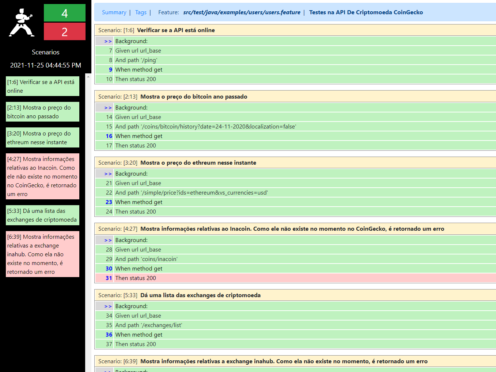

# Teste de API 


## Questão 1



### Como Executar

   1. Instalar o maven e configurar as variáveis de ambiente

   2. Executar no terminal, no diretório do projeto, esse comando:
   
    ```bash
    mvn clean test -f "pom.xml" -Dtest=ApiTestRunner "-Dkarate.options=src\test\java\examples\users\users.feature"
    ```
## Questão 2

### 1. Quantas suítes de testes você desenvolveu?

Foi desenvolvida uma suíte de teste, que contém seis testes.(4 positivos, 2 negativos).

### 2. Os testes desenvolvidos são manuais ou automatizados?

Eles são automatizados.

### 3. Onde os testes se localizam na pirâmide apresentada?

Eles se localizam na parte de testes de serviço.

### 4. Os testes desenvolvidos são funcionais ou não-funcionais?

Eles são funcionais.

### 5. Alguns dos testes desenvolvidos são testes Fim-a-Fim (End-To-End)?

Sim,pois eles verificam se a API é capaz de pegar as informações corretar.

### 6. O que se deve fazer para que os testes desenvolvidos funcionem em modo regressão?

Deve-se usar tags para automatizar a bateria de testes.
